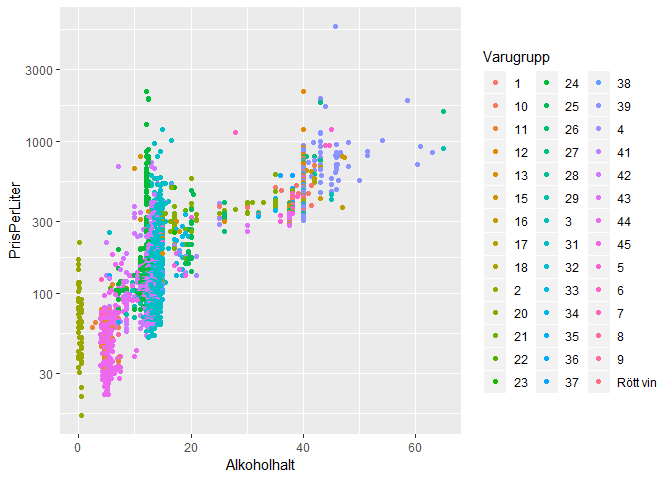
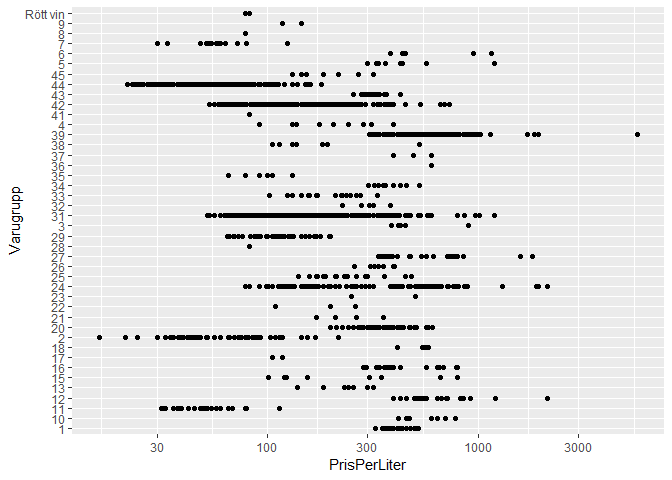
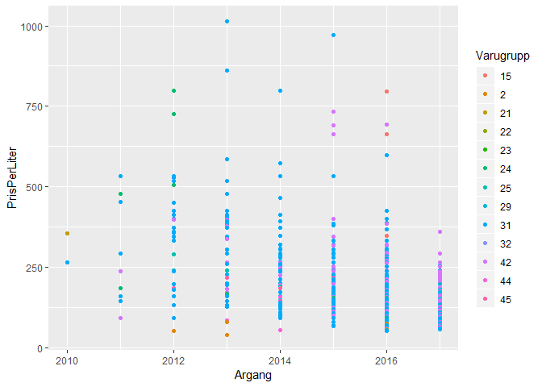

R Notebook
================

Systembolaget’s assortment
==========================

### Training with `arrange`, `filter`, `mutate`, `select`, `%>%`

``` r
library(tidyverse)
```

    ## -- Attaching packages --------------------------------------------------------------------------------- tidyverse 1.2.1 --

    ## v ggplot2 3.1.0     v purrr   0.2.5
    ## v tibble  1.4.2     v dplyr   0.7.7
    ## v tidyr   0.8.2     v stringr 1.3.1
    ## v readr   1.1.1     v forcats 0.3.0

    ## -- Conflicts ------------------------------------------------------------------------------------ tidyverse_conflicts() --
    ## x dplyr::filter() masks stats::filter()
    ## x dplyr::lag()    masks stats::lag()

``` r
library(knitr)

Sortiment_hela <-read.csv("../Class_files/systembolaget2018-10-08.csv", encoding = "UTF-8")

# Convert Alkoholhalt to numeric
Sortiment_hela <- mutate(Sortiment_hela,
       Alkoholhalt = as.numeric(gsub("%", "", Alkoholhalt))
         
)

# Mutate Varugrupp
Sortiment_hela <- Sortiment_hela %>%
  mutate(Varugrupp = ifelse(Varugrupp == "Röda", "Rött vin", Varugrupp),
         Varugrupp = ifelse(Varugrupp == "Vita", "Vitt vin", Varugrupp)
         ) 

# Extract name for vbeverage with highest price per liter
max_PrisPerLiter_namn <- filter(Sortiment_hela, PrisPerLiter == max(PrisPerLiter))[1, "Namn"]


#New data table and table
Sortiment_ord <- Sortiment_hela %>%
        filter(SortimentText == "Ordinarie sortiment") %>%
        arrange(desc(PrisPerLiter))

Sortiment_ord %>% 
        select(nr, Namn, Prisinklmoms, Varugrupp, Argang) %>%
        head(n = 10) %>%
        kable(format = "markdown")
```

|       nr| Namn                        |  Prisinklmoms| Varugrupp |  Argang|
|--------:|:----------------------------|-------------:|:----------|-------:|
|  7013501| Highland Park               |          3995| 39        |      NA|
|  8015701| Hennessy                    |          1499| 12        |      NA|
|   749401| Krug                        |          1599| 24        |      NA|
|   754801| Cuvée Sir Winston Churchill |          1450| 24        |    2006|
|  1049901| The Glenlivet               |          1349| 39        |      NA|
|   742801| Dom Pérignon                |          1424| 24        |    2009|
|  2048801| Glengoyne                   |          1299| 39        |      NA|
|  8531901| Kavalan                     |          1299| 39        |      NA|
|  8671501| Diplomático                 |          1269| 27        |    2004|
|    30201| Jura                        |          1199| 39        |      NA|

The beverage with the highest price per liter is Highland Park .

### Training with `ggplot`, `geom_point`, `geom_line`, `facet_wrap`

``` r
#Plot PrisPerLiter against Alkoholhalt
ggplot(Sortiment_ord, aes(x = Alkoholhalt, y = PrisPerLiter, color = Varugrupp)) +
        geom_point() +
        scale_y_log10()
```



``` r
#Plot PrisPerLiter against Varugrupp
ggplot(Sortiment_ord, aes(x = Varugrupp, y = PrisPerLiter)) +
        geom_point() +
        coord_flip() +
        scale_y_log10()
```



``` r
#It doesn't excist any group with the namnes in the given vector c("Vitt vin", "Rött vin", "Rosévin", "Mousserande vin")
Sortiment_ord %>% filter(Argang %in% c(seq(2010, 2017))) %>%
        ggplot(mapping = aes(x = Argang, y = PrisPerLiter, color = Varugrupp)) +
        geom_point()
```



Film events
===========

``` r
film_events <- read.csv("../Class_files/Film_events_2018-11-07.csv", encoding = "UTF-8")

# List soldout films
films_soldout <- film_events %>% 
        group_by(eventName_en) %>%
        filter(all(eventTicketStatus == "soldout")) %>%
        select(eventName_en) %>%
        unique()

films_soldout
```

    ## # A tibble: 2 x 1
    ## # Groups:   eventName_en [2]
    ##   eventName_en                                   
    ##   <fct>                                          
    ## 1 Stockholm XXIX Short Film Competition: Identity
    ## 2 Shoplifters
