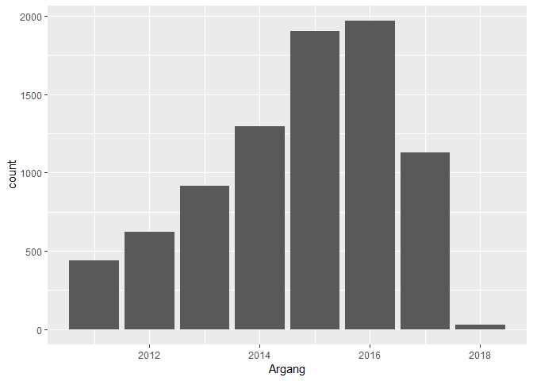
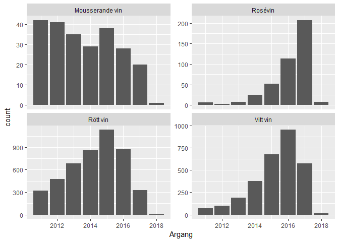
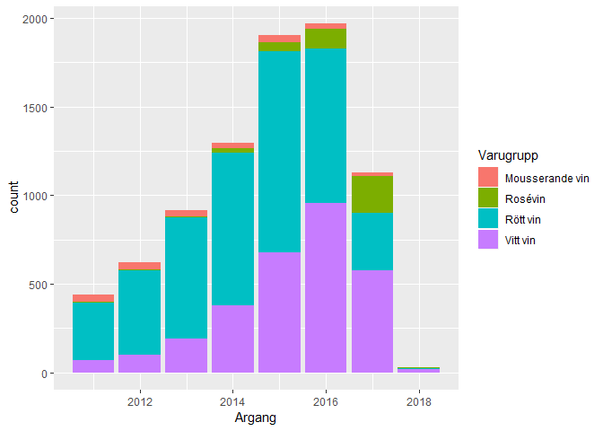
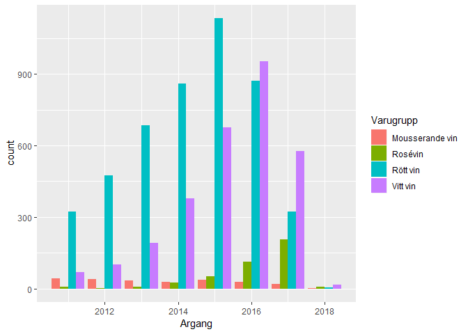
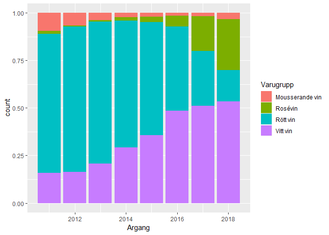
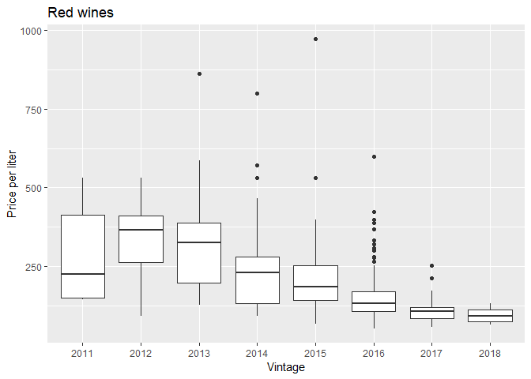
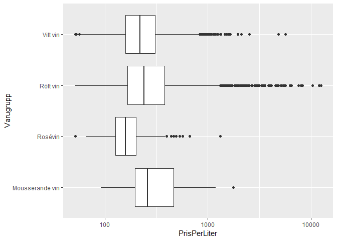

Day 4
================
2018-11-12

``` r
library(tidyverse)
```

Systembolaget
=============

``` r
#Load data
sortiment <- read_csv("../Class_files/systembolaget2018-10-08.csv")

# Filter
kategorier <-  c("Vitt vin", "Rött vin", "Rosévin", "Mousserande vin") 
sortiment_2011_2018 <- filter(sortiment, Varugrupp %in% kategorier & between(Argang, 2011, 2018))
```

``` r
#Plots to compare
ggplot(sortiment_2011_2018, aes(Argang)) +
  geom_bar()

ggplot(sortiment_2011_2018, aes(Argang)) +
  geom_bar() +
  facet_wrap(~ Varugrupp, scale = "free_y")

ggplot(sortiment_2011_2018, aes(x = Argang, fill = Varugrupp)) +
  geom_bar()

ggplot(sortiment_2011_2018, aes(x = Argang, fill = Varugrupp)) +
  geom_bar(position = "dodge")

ggplot(sortiment_2011_2018, aes(x = Argang, fill = Varugrupp)) +
  geom_bar(position = "fill")
```



``` r
# Reconstruct plot
filter(sortiment_2011_2018, Varugrupp == "Rött vin" & Sortiment == "FS") %>%
  ggplot(aes(as.factor(Argang), PrisPerLiter)) +
    geom_boxplot() +
    labs(title = "Red wines") +
    xlab("Vintage") +
    ylab("Price per liter")
```



``` r
ggplot(sortiment_2011_2018, aes(Varugrupp, PrisPerLiter)) +
  scale_y_log10() +
  geom_boxplot() +
  coord_flip()
```



Winter medals
=============

``` r
medal_long <- read_csv("../Class_files/Winter_medals2018-09-26.csv") %>% 
    select(-Total) %>% 
    gather(Denomination, Number, c("Gold", "Silver", "Bronze"))

#Plot
total_medal <- medal_long %>% 
  group_by(`Country Code`, `Denomination`) %>% summarise(Count = sum(Number))

total_medal
```
