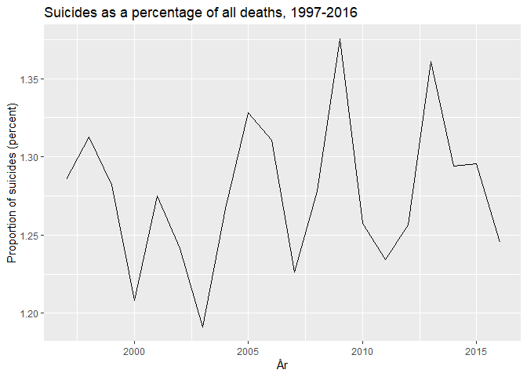
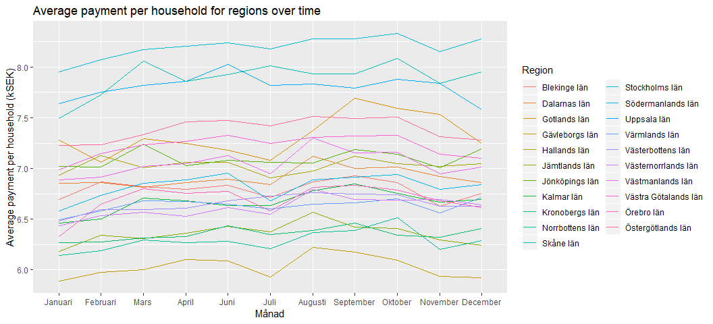

Day 5
================
2018-11-14

Dental data
===========

We import the tidyverse library and import the data from (;)-delimited csv-file. When importing the data we exclude the first row (skip = 1) as well as the last two rows (n\_max = 580) since they contain text and not ;-separated columns.

``` r
#Import tidyverse
library(tidyverse)

#Read dental data
dental_data <- read_csv2("../Class_files/Statistikdatabasen_2018-01-23 14_46_26.csv", skip = 1, n_max = 580)
```

Right know the data is in wide format so we will need to convert it to long (tidy) format.

``` r
#Convert data to long format
dental_data_tidy <- gather(dental_data, `2010`:`2016`, key = "år", value = "antal")
head(dental_data_tidy) #Have a look at data format
```

    ## # A tibble: 6 x 4
    ##   Region        Kön     år    antal
    ##   <chr>         <chr>   <chr> <int>
    ## 1 Upplands­Väsby Män     2010   8858
    ## 2 Upplands­Väsby Kvinnor 2010  10281
    ## 3 Vallentuna    Män     2010   7490
    ## 4 Vallentuna    Kvinnor 2010   8450
    ## 5 Österåker     Män     2010  10011
    ## 6 Österåker     Kvinnor 2010  11274

Suicide data
============

Next we are going to plot the proportion of suicides among total deaths by year for Sweden as a whole.

``` r
#Import data
data <- read_csv2("../Class_files/Statistikdatabasen_2018-01-23 15_04_12.csv", skip = 1, n_max = 80)

#Convert data to long (tidy) format
data_tidy <- gather(data, -(`År`:`Kön`), key = "Region", value = "Antal")

#Check for missing values in antal
data_tidy$Antal <- as.numeric(data_tidy$Antal) 

#Summarise data for year and diagnosis
data_tidy <- data_tidy %>% 
  drop_na() %>% #drop observations with missing values
  group_by(`År`, `Diagnos`) %>%
  summarise(Antal_tot = sum(`Antal`)) 

#Summarise data to suicides as part of all deaths and plot
data_tidy %>% ungroup() %>%
  group_by(`År`) %>%
  summarise(Andel = min(Antal_tot)/max(Antal_tot)) %>%
  ggplot(aes(År, 100*Andel)) +
  geom_line() +
  ylab(label = "Proportion of suicides (percent)")+
  labs(title = "Suicides as a percentage of all deaths, 1997-2016")
```



Social assistance
=================

``` r
#Import data
social_data <- read_csv2("../Class_files/Statistikdatabasen_2018-01-23 15_39_06.csv", skip = 2, n_max = 42)
```

There is somee work to do before we have data in a tidy format. Lets start transforming the data.

``` r
#Convert to long data
social_data_tidy <- gather(social_data, -(`Region`:`Mått`), key = "Period", value = "Värde")

#Seperate month and year
social_data_tidy <- separate(social_data_tidy, Period, c("Månad", "År"), sep = "_")

#Recode År values
social_data_tidy$År <- social_data_tidy$År %>%
  recode("1" = "2015", "2" = "2016", "3" = "2017") %>%
  replace_na("2014")

#Make months factor
month_levels <- c("Januari", "Februari", "Mars", "April", "maj", "Juni", 
                  "Juli", "Augusti", "September", "Oktober", "November", "December")
#social_data_tidy$Månad <- as.factor(social_data_tidy$Månad)
social_data_tidy$Månad <- factor(social_data_tidy$Månad, month_levels)

#Spread data to finally have a tidy format
social_data_tidy <- spread(social_data_tidy, Mått, Värde)
social_data_tidy$`Utbetalt ekonomiskt bistånd tkr` <- as.numeric(social_data_tidy$`Utbetalt ekonomiskt bistånd tkr`)
social_data_tidy$`Antal hushåll` <- as.numeric(social_data_tidy$`Antal hushåll`)
```

Now that the data is nicely formated we can create our plot.

``` r
#Pipe and plot
social_data_tidy %>% drop_na() %>% 
  group_by(Region, Månad) %>%
  summarise(avg_pay = sum(`Utbetalt ekonomiskt bistånd tkr`) /  sum(`Antal hushåll`)) %>%
  ggplot(aes(Månad, avg_pay, group = Region, color = Region)) +
  geom_line() +
  ylab("Average payment per household (kSEK)")+
  labs(title = "Average payment per household for regions over time")
```


