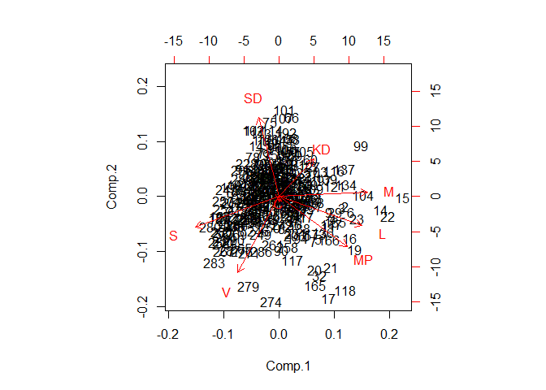

Day8
================

``` r
library(tidyverse)
```

Let's begin by loading the data for the 7 largest parties and scale the values. We will call the resulting data frame x.

``` r
election_data <- read_csv2("../Class_files/2018_R_per_kommun.csv")
  
x <- election_data %>% 
  select(M:SD) %>%
  scale()
```

*Compute the principal components of `X` using `princomp` and plot using `biplot`. Which parties seem to be most close/distant to SD in terms of municipal voting patterns?*

``` r
princomp(x) %>% biplot()
```



From the graph we can see that KD is the closest to SD in terms of municipality voting patterns. This is unsurprising since KD is also the most similar party in terms of political policy The other large parties, M and S, are somewhere between close and distant. The most distant parties are V and MP which have the most dissimilar party when it comes to political policy. Where is C?

*Perform hierarchical clustering of both `X` and `t(X)` (transpose of x) using `hclust` and plot the resulting object with `plot` (add suitable labels for the former using `labels`-option in `plot`).*

``` r
x %>% dist() %>% hclust() %>% plot(main = "Electorial districts cluster dendogram", 
                                      xlab = "Electorial districts")
```


``` r
t(x) %>% dist() %>% hclust() %>% plot(main = "Political parties cluster dendogram", 
                                      xlab = "Political parties")
```


*The file `Class_files/Kommungruppsindelning_2017.csv` contains a classification of Swedish municipalities (english translation). Join this with the election data (paste the first two columns of election data for a matching key).*

``` r
# Load the data
kommun <- read_csv2("../Class_files/Kommungruppsindelning_2017.csv")
```

We know need to find a key which is present in both dataframes. By running `` Kommun$`Kommun namn` %in% election_data$KOMMUNNAMN `` we can see that the two variables are matching keys let's merge the dataframes

``` r
#Join dataframes
joined <- kommun %>% inner_join(election_data, by = c("Kommun namn" ="KOMMUNNAMN"))
```

*Compute the singular value decomposition of `X` and extract the first two columns of the U matrix. Add these columns to the joined table above and plot them as points colored by the classification of municipalities. Does there seem to be a relation between voting patterns and classification (or do the points seem colored randomly)?*

``` r
svd1 <- svd(x) 
u12 <- svd1$u[, 1:2]
y <- joined %>% mutate(u1 = u12[,1], u2 = u12[,2])

y %>% ggplot(aes(x =u1, y = u2, colour = Grupp)) +
  geom_point()
```


We can see that there appears to be some visible patterns in how people in different municipality groups vote.
